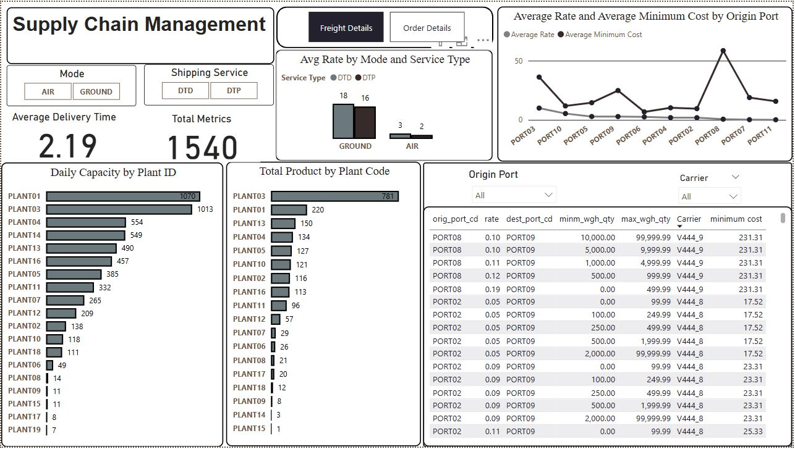
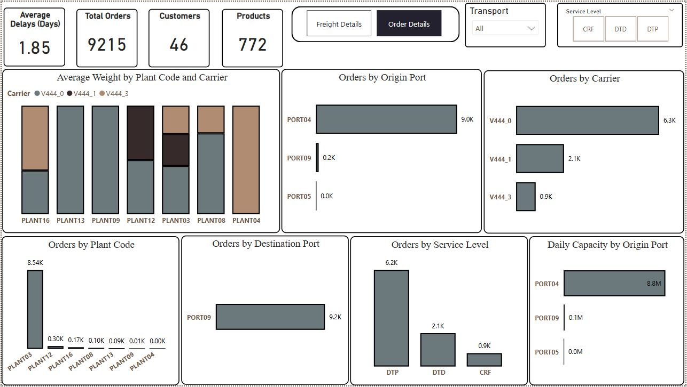

# Supply-Chain-Logistics-Analysis
Analysis of supply chain logistics data and retrieve key information from it.

# Dashboard Overview – Page 1: Freight Details
This page is designed to monitor and evaluate freight operations, offering detailed visualizations of delivery efficiency and plant performance.

## Key Visuals:
* KPI Cards: Display average delivery time and total operational metrics.

* Interactive Filters: Allow users to toggle between modes (Air/Ground) and service types (DTD/DTP).

* Bar Chart – Avg Rate by Mode & Service Type: Compares shipping rates by transport type and delivery method.

* Line Chart – Avg Rate & Min Cost by Port: Tracks cost trends across origin ports, enabling cost-efficient planning.

## Bar Charts:

* Daily Capacity by Plant ID: Highlights operational capacity at each plant.

* Total Product by Plant Code: Displays production volume per plant.

* Data Table – Origin Port Metrics: Lists rates, min/max weight, and shipping costs, filterable by carrier and port.

# Dashboard Overview – Page 2: Order Details
This page shifts focus to customer orders, service levels, and carrier performance, giving a holistic view of the delivery lifecycle.

##Key Visuals:
* KPI Cards: Summarize average delivery delays, total orders, customers, and product count.

* Stacked Bar Chart – Avg Weight by Plant & Carrier: Compares load distribution across plants and carriers.

## Bar Charts:

* Orders by Origin Port: Identifies the main sources of outbound logistics.

* Orders by Carrier: Highlights carrier workload and preferences.

* Orders by Plant Code: Reveals order volume per production facility.

* Orders by Destination Port: Tracks delivery volume per destination.

* Orders by Service Level: Compares use of service types (DTP, DTD, CRF).

* Daily Capacity by Origin Port: Assesses shipping potential from each origin.

